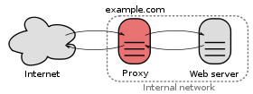

# Configuración de un proxy inverso

Un proxy inverso es un tipo de servidor proxy que recupera recursos en nombre de un cliente desde uno o más servidores. Por lo tanto el cliente hace la petición al puerto 80 del proxy, y éste es el que hace la petición al servidor web que normalmente está en una red interna no accesible desde el cliente.

## Apache como proxy inverso

Apache2.4 puede funcionar como proxy inverso usando el módulo `proxy` junto a otros módulos, por ejemplo:

* proxy_http: Para trabajar con el protocolo HTTP.
* proxy_ftp: Para trabajar con el protocolo FTP.
* proxy_html: Permite reescribir los enlaces HTML en el espacio de direcciones de un proxy.
* proxy_ajp: Para trabajar con el protocolo AJP para Tomcat.
* ...

Por lo tanto, para empezar, vamos activar los módulos que necesitamos:

	# a2enmod proxy proxy_http

## Ejemplo de utilización de proxy inverso

Tenemos a nuestra disposición un servidor interno (no accesible desde el cliente) en la dirección privada, con el nombre de `interno.example.org`. Tenemos un servidor que va a funcionar de proxy, llamado `proxy.exampleservidor.example.org` con dos interfaces de red: una pública conectada a la red donde se encuentra el cliente, y otra interna conectada a la red donde se encuentra el servidor interno.	

### Sirviendo una página estática

En nuestro servidor interno hemos creado un virtual host para servir una página estática, `index.html`.
Vamos a utilizar la directiva [`ProxyPass`](https://httpd.apache.org/docs/2.4/mod/mod_proxy.html#proxypass) en el fichero de configuración del virtual host, de la siguiente forma:

	ProxyPass "/web/" "http://interno.example.org/"

También lo podemos configurar de forma similar con:

	<Location "/web/">
		ProxyPass "http://interno.example.org/"
	</Location>

Evidentemente debe funcionar la resolución de nombre para que el proxy pueda acceder al servidor interno.

De esta manera al acceder desde el cliente la URL `http://servidor.example.org/web/` se mostraría la página que se encuentra en el servidor interno.

### El problema de las redirecciones

Cuando creamos una redirección en un servidor web y el cliente intenta acceder al recurso, el servidor manda una respuesta con código de estado `301` o `302`, e indica la URL de la nueva ubicación del recurso en una cabecera HTTP llamada `Location`.

Si hemos configurado una redirección en el servidor interno, cuando se accede al recurso a través del proxy, la redirección se realiza pero la cabecera `Location` viene referencia la dirección del servidor interno, por lo que el cliente es incapaz de acceder a la nueva ubicación. Para solucionarlo utilizamos la directiva [`ProxyPassReverse`](https://httpd.apache.org/docs/2.4/mod/mod_proxy.html#proxypassreverse) que se encarga de reescribir la URL de la cabecera `Location`.

La configuración quedaría:

	ProxyPass "/web/" "http://interno.example.org/"
	ProxyPassReverse "/web/" "http://interno.example.org/"

O de esta otra forma:

	<Location "/web/">
		ProxyPass "http://interno.example.org/"
		ProxyPassReverse "http://interno.example.org/"
	</Location>

### El problema de las rutas HTML

La página que servimos a través del proxy que se guarda en el servidor interno puede tener declarada rutas, por ejemplo en imágenes o enlaces. Nos podemos encontrar con diferentes tipos de rutas:

* `http://interno.example.org/imagen.jpg`: Una ruta absoluta donde aparece la dirección del servidor interno y que evidentemente el cliente no va a poder seguir.
* `/imagen.jpg`: Una ruta absoluta, referenciada a la raíz del `DocumentRoot`.
* `imagen.jpg`: Una ruta relativa.

Si tenemos una ruta relativa, el cliente la va a poder seguir sin problema cuando accede a través del proxy, pero si tenemos una ruta como la segunda no lo va a poder hacer, porque en el `DocumentRoot` del proxy no existe este recurso.

Para solucionar este problema debemos reescribir el HTML para cambiar la referencia del enlace. Para ello necesitamos activar un nuevo módulo:

	# a2enmod proxy_html

Y realizar la siguiente configuración:

	ProxyPass "/web/"  "http://interno.example.org/"
	ProxyPassReverse "/web/"  "http://interno.example.org/"
	ProxyHTMLURLMap http://interno.example.org /web
	<Location /web/>
	    ProxyPassReverse /
	    ProxyHTMLEnable On
	    ProxyHTMLURLMap / /web/
	</Location>

Como vemos hemos configurado un proxy para HTML, que será responsable de reescribir todos las rutas que contiene el HTML, utilizando la directiva [`ProxyHTMLURLMap`](https://httpd.apache.org/docs/2.4/mod/mod_proxy_html.html#proxyhtmlurlmap):

	ProxyHTMLURLMap http://interno.example.org /web

Es importante no poner la barra final, cuando se encuentra una ruta que coincide con el primer patrón se reescribe con el segundo, esta regla reescribe las ruta del tipo de la primera opción que hemos visto anteriormente. Para arreglar la rutas de la segunda opción, utilizamos dentro de la sección `Location`:

	ProxyHTMLURLMap / /web/

Después de iniciar comprobamos que al intentar acceder al proxy obtenemos un error en el navegador del cliente "Error de codificación de contenido".

### Sirviendo contenido multimedia

Acabamos de configurar un proxy que examina y reescribe el HTML de nuestro sitio web, pero evidentemente existe más contenido en nuestro sitio que no es HTML y no debería ser procesado por `proxy_html`. Esto se soluciona verificando la cabecera del contenido y rechazando todos los contenidos que no tengan el tipo MIME adecuado.

Pero tenemos un problema: normalmente se comprime el contenido HTML, y encontramos cabeceras de este tipo:

	Content-Type: text/html
    Content-Encoding: gzip

Este contenido no debería pasar por el analizador de `proxy_html`. Para solucionar esto podemos negarnos a admitir la compresión. La eliminación de cualquier cabecera de petición  `Accept-Encoding` hace el trabajo. Para ello podemos utilizar la directiva [`RequestHeader`](http://httpd.apache.org/docs/current/mod/mod_headers.html#requestheader) del módulos `headers`, por lo tanto activamos el módulo:

	# a2enmod headers

Y usamos la directiva `RequestHeader` dentro del la sección `Location`:

	ProxyPass "/web/"  "http://interno.example.org/"
	ProxyPassReverse "/web/"  "http://interno.example.org/"
	ProxyHTMLURLMap http://interno.example.org /web
	<Location /web/>
	    ProxyPassReverse /
	    ProxyHTMLEnable On
	    ProxyHTMLURLMap / /web/
	    RequestHeader unset Accept-Encoding
	</Location>
	
Ahora si podemos acceder a la página completa a través del proxy.
